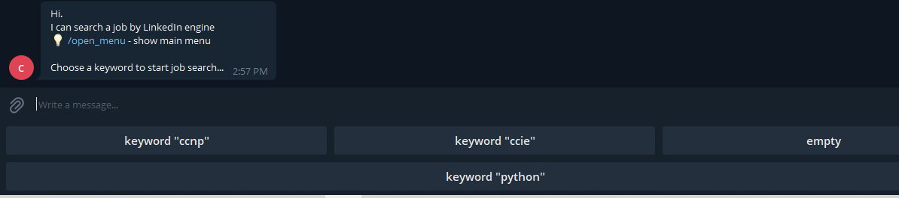
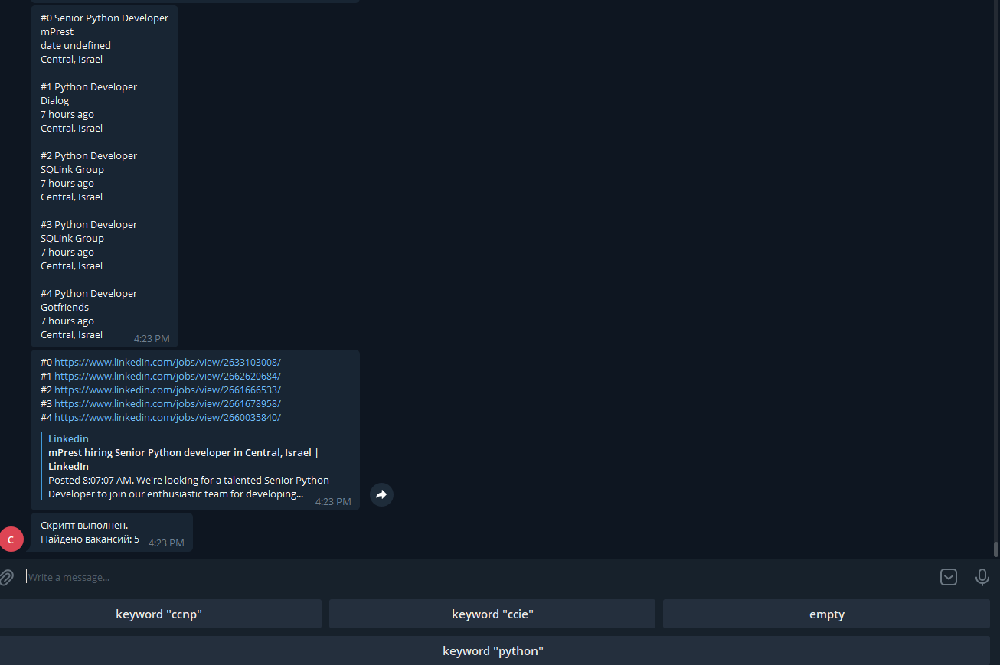

#
#### [English](#English) / [Russian](#Russian)

# LinkedIn job search bot

 

## Introduction
bot-linkedin is Telegram bot for searching a jobs. 
Bot is developed for me to help a jobs for specific keywords: ccnp, ccie, python.
Keywords are hardcoded in pre-installed urls.

## Getting started

1. Clone repositary, activate env (if you want) and install requirements:

~~~~~~~~~~~~~~~~~~~~~~~~~~~~~~~~~~~~~~~~~~~~~~~~~~~~~~~~~~~~~~~~~~~~~~~~~~~~~~~~
git clone https://github.com/bbossankimster/bot-linkedin.git
cd bot-linkedin
python -m venv env
source ./env/bin/activate
pip install -r req.txt
~~~~~~~~~~~~~~~~~~~~~~~~~~~~~~~~~~~~~~~~~~~~~~~~~~~~~~~~~~~~~~~~~~~~~~~~~~~~~~~~

2. Copy tmplate_settings.py from templates to bot-linkedin dir

3. Create Telegram bot according https://t.me/botfather instructions and get a token.

4. Open settings.py for edit
4.1 Put your token and Telegram user id
Get user id from bot @getmyid_bot
You can add multiple users to bot access.
4.2 Change the language if you want (settings.py)
4.3 Change the path to chromedriver.exe and directory to chromedriver cache.

~~~~~~~~~~~~~~~~~~~~~~~~~~~~~~~~~~~~~~~~~~~~~~~~~~~~~~~~~~~~~~~~~~~~~~~~~~~~~~~~
API_KEY = "YOUR_API_KEY"
USERS = [USER_ID1, USER_ID2]
LANG = "ru"
# LANG = "en"
~~~~~~~~~~~~~~~~~~~~~~~~~~~~~~~~~~~~~~~~~~~~~~~~~~~~~~~~~~~~~~~~~~~~~~~~~~~~~~~~

## Basic usage

1. Run Python bot application and run bot in Telegram:

~~~~~~~~~~~~~~~~~~~~~~~~~~~~~~~~~~~~~~~~~~~~~~~~~~~~~~~~~~~~~~~~~~~~~~~~~~~~~~~~
python bot.py
~~~~~~~~~~~~~~~~~~~~~~~~~~~~~~~~~~~~~~~~~~~~~~~~~~~~~~~~~~~~~~~~~~~~~~~~~~~~~~~~

2. Press a button with desired keyword to start job search...

3. Wait a search result. It takes 3-5 minutes.

 

# Бот для поиска вакансий в LinkedIn

## Описание бота

Бот выполняет парсинг поисковой страницы LinkedIn и выводит результат поиска в виде списка вакансий (название вакансии, фирма, дата вакансии, географическое расположение) и ссылок для просмотра вакансии.
Парсинг выполняется по предустановленным URL в settings.py
Для парсинга используется selenium.webdriver.
Пути для  webdriver прописаны в settings.py

## Начальная установка и настройка

1. Склонируйте репозистрарий, активируйте virtual env (если нелбходимо), установите зависимости и модули

~~~~~~~~~~~~~~~~~~~~~~~~~~~~~~~~~~~~~~~~~~~~~~~~~~~~~~~~~~~~~~~~~~~~~~~~~~~~~~~~
git clone https://github.com/bbossankimster/bot-linkedin.git
cd bot-linkedin
python -m venv env
source ./env/bin/activate
# env\Scripts\activate.ps1
pip install -r req.txt
~~~~~~~~~~~~~~~~~~~~~~~~~~~~~~~~~~~~~~~~~~~~~~~~~~~~~~~~~~~~~~~~~~~~~~~~~~~~~~~~

2. Создайте Телеграм бота с помощью https://t.me/botfather и получите токен

3. Скопируйте tmplate_settings.py из templates в каталог bot-linkedin

4. Откройте файл settings.py
4.1 Добавьте токен
4.2 Добавьте id пользователей, которым будет разрешен доступ к боту.
Определить id пользователя можно с помощью бота @getmyid_bot
4.3 Если нужно, поменяйте языковые настройки бота
4.4 Поменяйте путь до chromedriver.exe и каталог для сохранения кэша chromedriver.

~~~~~~~~~~~~~~~~~~~~~~~~~~~~~~~~~~~~~~~~~~~~~~~~~~~~~~~~~~~~~~~~~~~~~~~~~~~~~~~~
API_KEY = "YOUR_API_KEY"
USERS = [USER_ID1, USER_ID2]
LANG = "ru"
# LANG = "en"

WEBDRIVER = 'C:\\bot-linkedin\\env\\Scripts\\chromedriver.exe'
WD_CACHE = 'C:\\__chromedriver\\cache'
~~~~~~~~~~~~~~~~~~~~~~~~~~~~~~~~~~~~~~~~~~~~~~~~~~~~~~~~~~~~~~~~~~~~~~~~~~~~~~~~

## Запуск приложения

1. Запустите Python приложение и откройте бота в Телеграм

~~~~~~~~~~~~~~~~~~~~~~~~~~~~~~~~~~~~~~~~~~~~~~~~~~~~~~~~~~~~~~~~~~~~~~~~~~~~~~~~
python bot.py
~~~~~~~~~~~~~~~~~~~~~~~~~~~~~~~~~~~~~~~~~~~~~~~~~~~~~~~~~~~~~~~~~~~~~~~~~~~~~~~~

2. Нажмите кнупку с нужным ключевым словом

3. Дождитесь результата парсинга поисковой страницы и вывода результата.
Занимает 3-5 минут.

